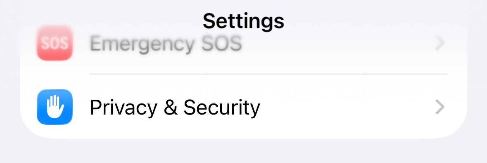
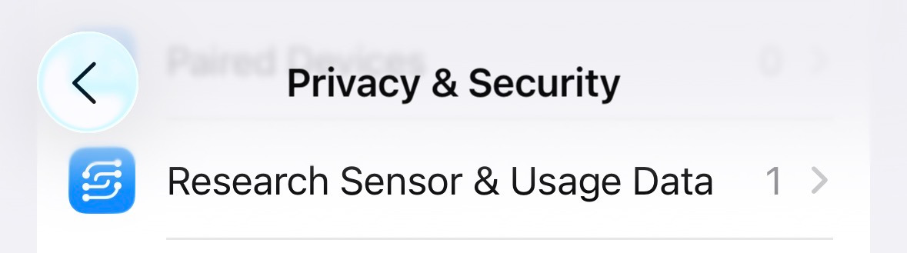
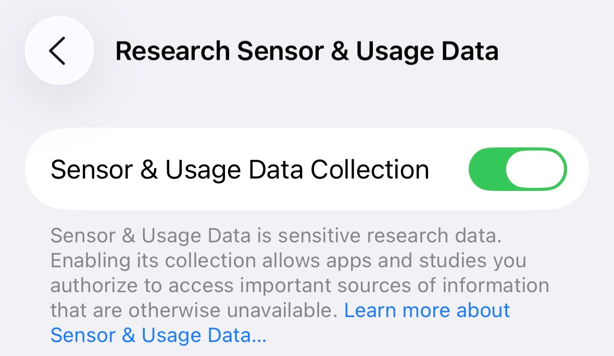

# Data Permissions and Dashboard

## SensorKit
If you have an Apple Watch, SensorKit can provide researchers with more in depth information.
To turn this on, you need to first toggle on "Sensor & Usage Data Collection" in settings.
To do this, go to: **Settings > Privacy & Security > Research Sensor & Usage Data > Toggle ON**

Once this is completed, return to My Heart Counts, click on your account in the upper right corner and you will see a SensorKit field to accept the final permissions. 

## Entering Data on the Dashboard
To enter data on the dashboard, tap on the field or value you would like to edit.
Once in the appropriate box, tap on the **"Add Data"** button in the **top right corner**.

Note that you must have write access turned on for HealthKit or these features will not work properly.
Additionally, you cannot enter data for Exercise Minutes or Sleep — these are both Apple Watch only values.
