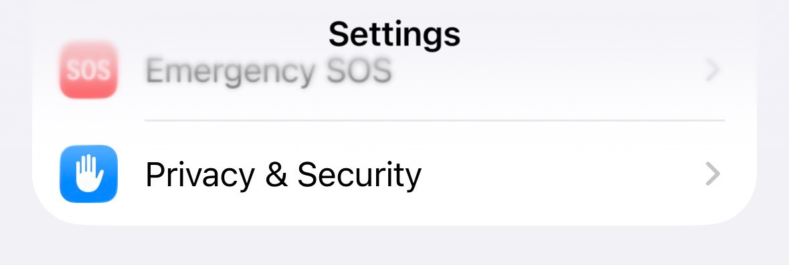
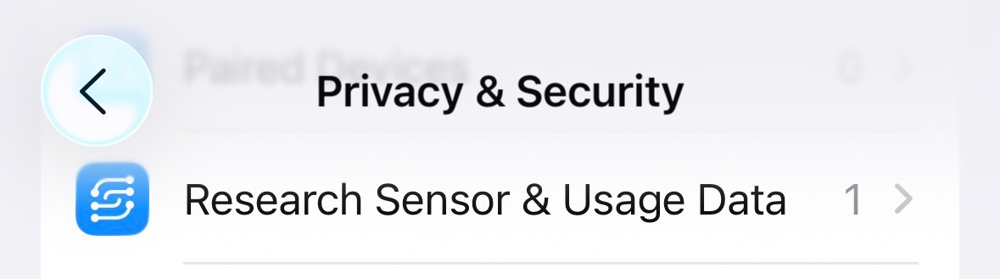
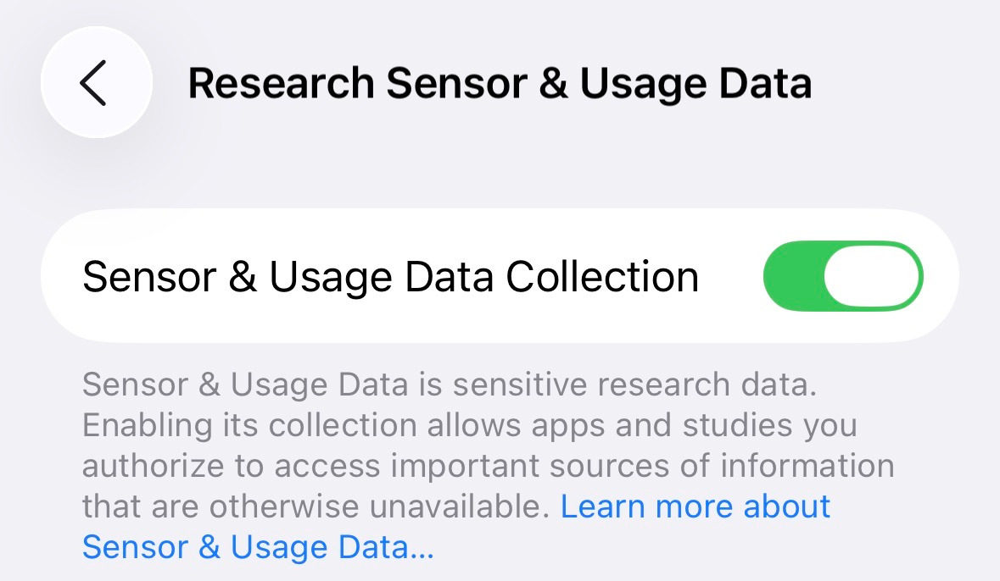

# Permisos de datos y panel

## SensorKit
Si tienes un Apple Watch, SensorKit puede proporcionar a los investigadores información más detallada.
Para activar esta función, primero debes activar “Sensor & Usage Data Collection” en Configuración.
Para hacerlo, dirígete a: **Configuración > Privacidad y seguridad > Research Sensor & Usage Data > Activar**

Una vez completado esto, selecciona tu cuenta en la esquina superior derecha y verás un campo de SensorKit para aceptar los permisos finales.

## Ingresar datos en el panel
Para ingresar datos en el panel, toca el campo o el valor que deseas editar.
Una vez en el recuadro correspondiente, toca el botón «Agregar datos» en la esquina superior derecha.

Ten en cuenta que debes tener habilitado el acceso de escritura para HealthKit; de lo contrario, estas funciones no funcionarán correctamente.
Además, no puedes ingresar datos de minutos de ejercicio ni de sueño; ambos son valores exclusivos de Apple Watch.
